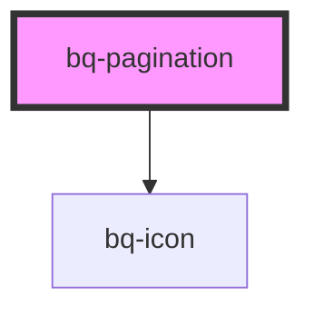

# bq-pagination

<!-- Auto Generated Below -->

## Overview

The Pagination component lets users navigate through a collection split into pages.

## Properties

| Property        | Attribute        | Description                                                           | Type                  | Default        |
| --------------- | ---------------- | --------------------------------------------------------------------- | --------------------- | -------------- |
| `arrows`        | `arrows`         | If `true`, it shows previous and next arrow controls                  | `boolean`             | `true`         |
| `boundaryCount` | `boundary-count` | Number of always-visible pages at the beginning and end               | `number`              | `1`            |
| `disabled`      | `disabled`       | If `true`, pagination controls cannot be interacted with              | `boolean`             | `false`        |
| `label`         | `label`          | The `aria-label` attribute used to describe the pagination navigation | `string`              | `'Pagination'` |
| `page`          | `page`           | The currently selected page                                           | `number`              | `1`            |
| `pages`         | `pages`          | The total number of pages                                             | `number`              | `1`            |
| `siblingCount`  | `sibling-count`  | Number of pages to show before and after the current page             | `number`              | `1`            |
| `size`          | `size`           | The size of the pagination controls                                   | `"medium" \| "small"` | `'medium'`     |

## Events

| Event      | Description                                          | Type                             |
| ---------- | ---------------------------------------------------- | -------------------------------- |
| `bqChange` | Handler to be called when the selected page changes. | `CustomEvent<{ page: number; }>` |

## Methods

### `goToPage(page: number) => Promise<void>`

Go to a specific page.

#### Parameters

| Name   | Type     | Description                  |
| ------ | -------- | ---------------------------- |
| `page` | `number` | - The page number to select. |

#### Returns

Type: `Promise<void>`

A promise that resolves when the page update has been handled.

### `nextPage() => Promise<void>`

Go to the next page.

#### Returns

Type: `Promise<void>`

A promise that resolves when the page update has been handled.

### `previousPage() => Promise<void>`

Go to the previous page.

#### Returns

Type: `Promise<void>`

A promise that resolves when the page update has been handled.

## Slots

| Slot              | Description                                     |
| ----------------- | ----------------------------------------------- |
| `"next-icon"`     | The icon content for the next page control.     |
| `"previous-icon"` | The icon content for the previous page control. |

## Shadow Parts

| Part                | Description                                           |
| ------------------- | ----------------------------------------------------- |
| `"button"`          | The page button elements.                             |
| `"ellipsis"`        | The ellipsis element.                                 |
| `"item"`            | The `li` element that wraps each pagination control.  |
| `"list"`            | The `ul` element that contains the pagination items.  |
| `"navigation"`      | The `nav` element that wraps the pagination controls. |
| `"next-button"`     | The next page button element.                         |
| `"previous-button"` | The previous page button element.                     |

## Dependencies

### Depends on

- [bq-icon](../icon)

### Graph

----------------------------------------------

*Built with [StencilJS](https://stenciljs.com/)*
