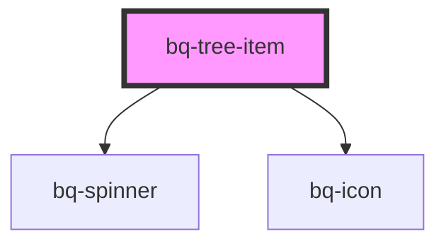

# bq-tree-item

<!-- Auto Generated Below -->

## Overview

A tree item represents one node in a hierarchical `bq-tree`.

## Properties

| Property        | Attribute       | Description                                             | Type      | Default |
| --------------- | --------------- | ------------------------------------------------------- | --------- | ------- |
| `disabled`      | `disabled`      | Disables the tree item.                                 | `boolean` | `false` |
| `expanded`      | `expanded`      | Expands the tree item.                                  | `boolean` | `false` |
| `indeterminate` | `indeterminate` | Displays an indeterminate selection state.              | `boolean` | `false` |
| `lazy`          | `lazy`          | Enables lazy loading behavior.                          | `boolean` | `false` |
| `selected`      | `selected`      | Displays the tree item as selected.                     | `boolean` | `false` |
| `tabIndex`      | `tabindex`      | Sets the item in or out of the tree's roving tab order. | `number`  | `-1`    |

## Events

| Event             | Description                                                                   | Type                                 |
| ----------------- | ----------------------------------------------------------------------------- | ------------------------------------ |
| `bqAfterCollapse` | Emitted after the tree item collapses.                                        | `CustomEvent<HTMLBqTreeItemElement>` |
| `bqAfterExpand`   | Emitted after the tree item expands.                                          | `CustomEvent<HTMLBqTreeItemElement>` |
| `bqCollapse`      | Emitted before the tree item collapses; cancel the event to keep it expanded. | `CustomEvent<HTMLBqTreeItemElement>` |
| `bqExpand`        | Emitted before the tree item expands; cancel the event to keep it collapsed.  | `CustomEvent<HTMLBqTreeItemElement>` |
| `bqLazyLoad`      | Emitted when a lazy item needs its children loaded.                           | `CustomEvent<HTMLBqTreeItemElement>` |

## Methods

### `getChildrenItems(options?: { includeDisabled?: boolean; }) => Promise<HTMLBqTreeItemElement[]>`

Gets the direct child tree items.

#### Parameters

| Name      | Type                             | Description                                        |
| --------- | -------------------------------- | -------------------------------------------------- |
| `options` | `{ includeDisabled?: boolean; }` | - Controls whether disabled children are included. |

#### Returns

Type: `Promise<HTMLBqTreeItemElement[]>`

A promise containing the direct child tree items.

### `vFocus() => Promise<void>`

Moves focus to the tree item.

#### Returns

Type: `Promise<void>`

A promise that resolves after focus is moved.

## Slots

| Slot              | Description                                    |
| ----------------- | ---------------------------------------------- |
|                   | The tree item label.                           |
| `"collapse-icon"` | The icon displayed when the item is expanded.  |
| `"expand-icon"`   | The icon displayed when the item is collapsed. |
| `"prefix"`        | Decorative content displayed before the label. |
| `"suffix"`        | Content displayed after the label.             |

## Shadow Parts

| Part              | Description                            |
| ----------------- | -------------------------------------- |
| `"base"`          | The component's base wrapper.          |
| `"checkbox"`      | The multiple-selection indicator.      |
| `"children"`      | The container for nested tree items.   |
| `"expand-button"` | The expand and collapse control.       |
| `"indentation"`   | The nested item indentation container. |
| `"item"`          | The selectable item row.               |
| `"label"`         | The tree item label.                   |
| `"prefix"`        | The prefix content container.          |
| `"spinner"`       | The lazy-loading spinner.              |
| `"suffix"`        | The suffix content container.          |

## Dependencies

### Depends on

- [bq-spinner](../spinner)
- [bq-icon](../icon)

### Graph

----------------------------------------------

*Built with [StencilJS](https://stenciljs.com/)*
